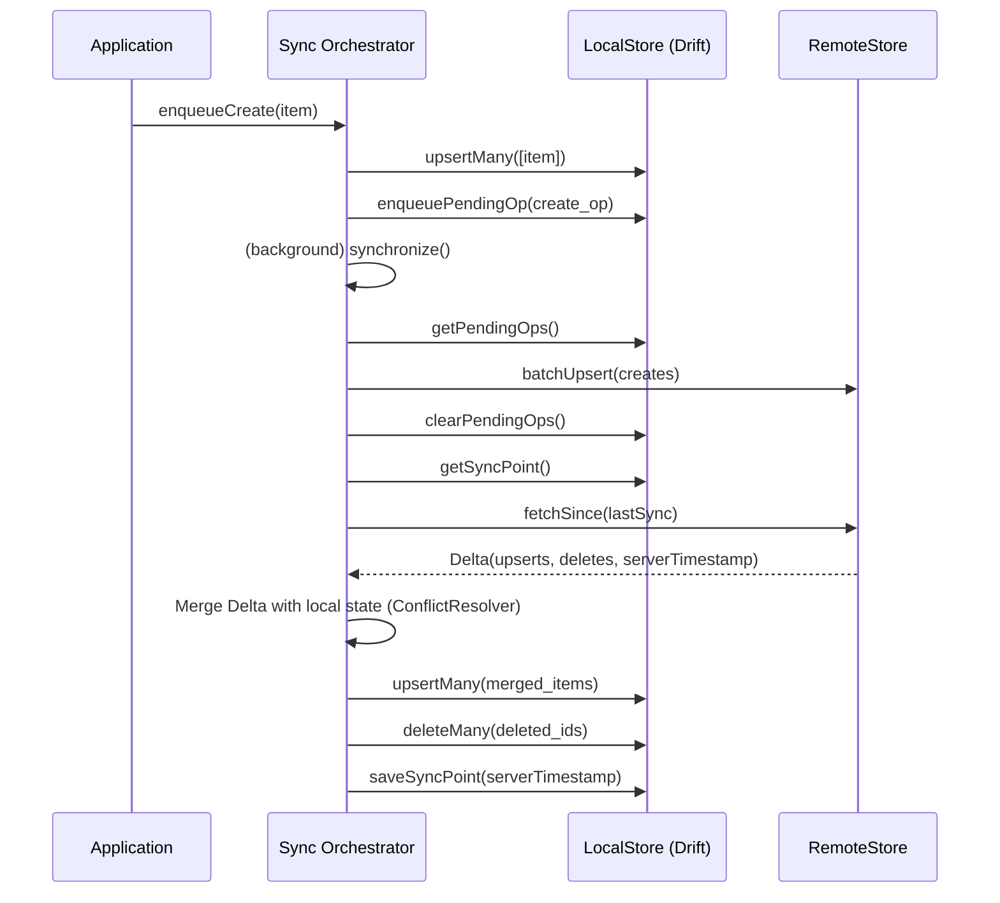

# Technical Design Document: `just_sync`

## 1. Overview

`just_sync` is a Flutter package that provides a robust, flexible, and efficient solution for synchronizing data between a local [Drift](https://drift.simonbinder.eu/) database and a remote backend. It acts as a middleware, offering various synchronization policies and customizable conflict resolution strategies.

Its primary design goal is to abstract away the complexities of offline-first data synchronization while empowering developers to leverage the full, strongly-typed power of SQL for local data querying, a significant improvement over storing data in generic JSON blobs.

## 2. Core Concepts & Philosophy

The architecture is built on a few key principles:

*   **Orchestrator Pattern:** A central `SyncOrchestrator` manages the entire synchronization process, coordinating between the local and remote data sources.
*   **Separation of Concerns:** The `LocalStore` and `RemoteStore` interfaces create a clean separation between the local database logic and the remote backend API. This makes the system modular and extensible (e.g., swapping Supabase for Appwrite).
*   **Strongly-Typed Local Storage:** The package is designed to work with native Drift tables. Instead of serializing models into a single generic table, developers define their own strongly-typed tables. This allows for type-safe, efficient SQL queries directly on the local database.
*   **Capability-Based Generics:** The system avoids library-specific "marker" mixins. Instead, it uses explicit generic constraints (e.g., `<T extends DataClass & HasUpdatedAt>`) to define the capabilities a data model must have. This reduces boilerplate and improves clarity.
*   **UTC Timestamps by Default:** All internal `DateTime` operations, especially for `updatedAt` timestamps, are strictly handled in UTC to ensure consistency and prevent timezone-related bugs. This is enforced at the database level with a custom `UtcDateTimeConverter`.

## 3. Architectural Deep Dive

### 3.1. `core/` - The Engine

This directory contains the backend-agnostic abstractions that drive the package.

*   **`SyncOrchestrator`:** The main public-facing interface. Its primary implementation, `SimpleSyncOrchestrator`, handles the synchronization flow:
    1.  Flushing pending offline operations (creates, updates, deletes) to the remote.
    2.  Fetching remote changes (`Delta`) since the last sync point.
    3.  Applying a `ConflictResolver` to merge changes.
    4.  Committing the merged changes to the `LocalStore`.
    5.  Updating the sync point timestamp.
*   **`StoreInterfaces`:** Defines the `LocalStore` and `RemoteStore` abstract classes, which represent the contract for local and remote data sources.
*   **`ConflictResolver`:** An interface for merging conflicting local and remote data. The default `LastWriteWinsResolver` uses the `updatedAt` timestamp from the `HasUpdatedAt` trait.

### 3.2. `models/` - The Models

This directory contains the data structures used for communication within the package.

*   **`SyncScope`:** A crucial concept that defines a logical subset of data to be synchronized (e.g., all tasks for a specific user).
*   **`Delta`:** Represents a set of changes (`upserts` and `deletes`) fetched from the remote store.
*   **`QuerySpec`:** A normalized, backend-agnostic description of a query, containing filters (`FilterOp`), ordering (`OrderSpec`), and pagination. This is translated into native queries by the respective store implementation (Drift SQL or Supabase PostgREST).
*   **`PendingOp`:** Represents a single offline write operation (create, update, delete) that is queued in the local database to be sent to the remote store later.
*   **`traits.dart`:** Contains `HasId<Id>` and `HasUpdatedAt`, simple interfaces that data models must implement to be compatible with the sync engine.

### 3.3. `local/drift/` - The Local Store

This is the highly-optimized implementation for using Drift as the local data source.

*   **`DriftLocalStore<T, Id>`:** A generic, abstract base class that contains the majority of the logic for interacting with a Drift database. It implements all the complex query logic (`queryWith`, `querySince`, `getById`) by translating `QuerySpec` into Drift select statements.
*   **Developer's Responsibility:** To use `DriftLocalStore`, a developer only needs to extend it and implement a few simple, abstract methods:
    *   `table`: Return the Drift `TableInfo` object.
    *   `resolveColumn`: Map a string field name to a Drift `GeneratedColumn`.
    *   `toInsertCompanion`, `toUpdateCompanion`, `toSoftDeleteCompanion`: Map the data model `T` to the appropriate Drift `Companion` for writing.
    *   `fromJson`: Map a JSON `Map` to the data model `T`.
*   **`DriftSyncTableMixin`:** A critical mixin that developers **must** add to their Drift `Table` definitions. It provides the `updatedAt`, `scopeName`, and `scopeKeys` columns.
*   **`UtcDateTimeConverter`:** This custom Drift `TypeConverter` is applied to the `updatedAt` column by the mixin. It guarantees that all `DateTime` values are read from and written to the database as UTC, preventing timezone bugs at the lowest level.

### 3.4. `remote/` - The Remote Store

This directory contains implementations for remote backends.

*   **`SupabaseRemoteStore`:** The default remote implementation. It translates `just_sync` operations into HTTP requests to a Supabase backend using the PostgREST API. It handles fetching deltas, batch writing, and translating `QuerySpec` to Supabase filters.

## 4. How to Use (for an LLM)

To implement `just_sync` for a new data model (e.g., `Todo`), follow these steps:

1.  **Define the Drift Table:** Ensure your `Todo` model class (generated by Drift) implements `DriftModel` with a generic type for the `id` column.
    ```dart
    import 'package:drift/drift.dart';
    import 'package:just_sync/just_sync.dart';

    @DataClassName('Todo', implementing: [DriftModel<String>])
    class Todos extends Table with DriftSyncTableMixin, JustSyncSoftDeleteTableMixin {
      TextColumn get id => text()();
      TextColumn get title => text()();
      BoolColumn get completed => boolean().withDefault(const Constant(false))();
      
      @override
      Set<Column> get primaryKey => {id};
    }
    ```

2.  **Create a `LocalStore` Implementation:**
    ```dart
    class TodoLocalStore extends DriftLocalStore<Todo, String> {
      TodoLocalStore(super.db);

      @override
      TableInfo get table => db.todos;
      
      // Implement the other abstract methods...
      // (resolveColumn, toInsertCompanion, etc.)
    }
    ```
3.  **Instantiate the Orchestrator:**
    ```dart
    final localStore = TodoLocalStore(myDriftDatabase);
    final remoteStore = SupabaseRemoteStore<Todo, String>(/* ...config... */);

    final orchestrator = SimpleSyncOrchestrator(
      localStore: localStore,
      remoteStore: remoteStore,
      conflictResolver: const LastWriteWinsResolver(),
    );
    ```
4.  **Use the Orchestrator:**
    ```dart
    // Synchronize data
    await orchestrator.synchronize(mySyncScope);

    // Query local data
    final todos = await orchestrator.query(mySyncScope);
    ```

## 5. Diagrams

*The diagrams from the original design document remain accurate and are reproduced here.*

```mermaid
graph TD
    A[Application] -->|Uses| B[just_sync Package]
    B -->|Manages| C[Sync Orchestrator]
    C -->|Interacts with| D[LocalStore (Drift)]
    C -->|Interacts with| E[RemoteStore (Supabase)]
    D -->|Stores data in| F[Drift Database]
    E -->|Communicates with| G[Supabase Backend]

    subgraph just_sync Package
        C
        D
        E
    end
```


